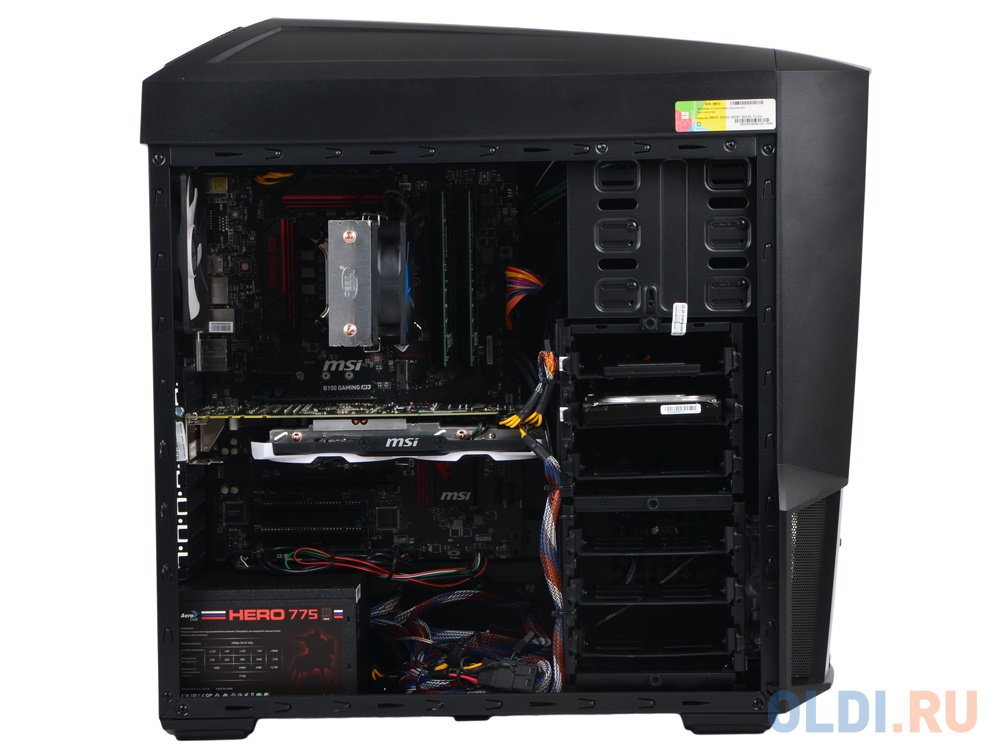

<html>
<head>

<title></title>
<meta charset="utf-8">
<link rel="stylesheet" type="text/css" href="style2.css">
<meta name="forma-detection" content="telephone=no"/>
<meta name="author" content="S Albert"/>
<meta name="vieport" content="width=device-width,
                              height=device-height"/>
<meta name="them-color" content="#fffccc"/>
<meta name="keywords" content="Купить компьютер,Девайсы,BuyDevice"/>
<meta name="description" content=""/>
<meta name="og:title" content="" />
<link rel="stylesheet" type="text/css" href="style1.css">
</head>
<body style="font-family: cooper black">

        <h2 flex md-truncate style="color:#fff;
         position:absolute; 
            left:1vw;
            top: 0.1vh;"
         ><big><strong> <em>BuyDevice</em></strong></big></h2>
        <a href="https://sakhibullin.github.io/Komp2.github.io/" style="color:#fff;
       position: absolute;
        top: 2vw;
        left:80vw;
         "> Главная</a>
                  <a href="https://sakhibullin.github.io/Komp3.github.io/" style="color:#Fff;
        position: absolute;
        top: 2vw;
        left:75vw;
         "> Корзина/</a>
         
Наши контакты 7(xxx)xxx-xx-xx

   

   <input type="e-mail" placeholder="Поиск..." name="Поиск" style="
position: absolute;
top: 2vh;
left: 23vw;
width: 43vw;
height: 6vh;
">

	<a href="#" onclick="document.getElementById('wtf').style.display='block'">

</a>
	<a href="#" onclick="document.getElementById('wtf2').style.display='block'">

</a>

<a href="#" onclick="document.getElementById('wtf3').style.display='block'">

    

</a>

    

  

Характеристики

<a href="#" 
style="position: absolute;
    top: 86.5vh;
    left: 32vw;"
>

Доставить

</a>

 

</body>
</html>
